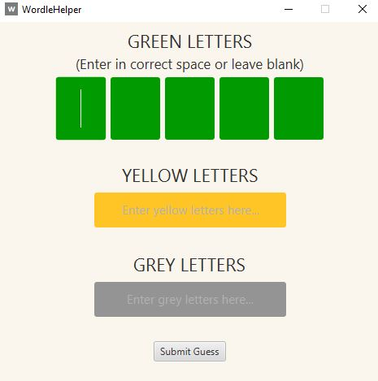
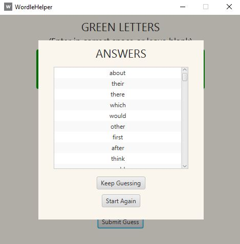

# WordleHelper

### **What is WordleHelper?**
---
WordleHelper is a Windows application written in Java that suggests the most likely solutions to the popular Wordle game based on a user's particular guess.

### **How do I use WordleHelper?**
---
1. Once you have submitted an initial guess into your Wordle game, take note of the results. 

2. If any of your letters have been marked green, place them in the appropriate space in the "GREEN LETTERS" fields in WordleHelper, leaving the other green fields blank. 

3. If any of your letters have been marked yellow, type them into the "YELLOW LETTERS" fields in WordleHelper.

4. If any of your letters have been marked grey, type them into the "GREY LETTERS" fields in WordleHelper.

5. Press "Submit Guess", upon which you will receive a list of the possible results, ordered by likelihood, as per the screenshot below. 

6. Enter your chosen guess into your Wordle game. If the guess is incorrect, you can press "Keep Guessing" in order to add more letters on to your previous guess. Alternatively, you can press "Play Again" to reset the screen and put in a guess for a new game. 

### **How does WordleHelper work?**
---

WordleHelper uses a recursive algrorithm to search through all possible permutations of five letter words given a user's guess input. 

This is done by checking each permutation against a list of English language words and their frequencies - the more common a word is in the English language, the higher priority it receives in the list of possible answers. 

In order to get a list of word frequencies, an [English language word list was used](https://github.com/dwyl/english-words). A short Python script was used that utilises the [wordfreq](https://pypi.org/project/wordfreq/) library. This script can be found in the "Resources" folder of this repository.

Each word in the list was checked against the relevant word frequency in the wordfreq library, and that frequency was added to the list. The total list is read into a Java HashMap when the application is launched and checked whenever a user submits a guess. 

### **Technologies used**
---

* **JavaFX**: It was decided that WordleHelper was more suited to a small desktop application than a web application. Because the user is already likely to have the Wordle game open on their phone or computer screen, it felt more convenient to have the helper application take the form of a small screen that the user can review at their convenience. JavaFX is useful for rapid development of GUIs, and given the small scope of the application it was decided that this was the most appropriate library to use.

* **Java**: The application is written in Java because it was decided to use JavaFX for the development of the GUI.

* **SceneBuilder**: The SceneBuilder tool was used to quickly generate the GUI layout in the form of an FXML file. 

* **Python**: Python was used to create a script that would add the word frequencies to the existing word list. Because this was a very small operation, and because Python supports the wordfreq library, Python was considered the best choice to perform this.

**END**

